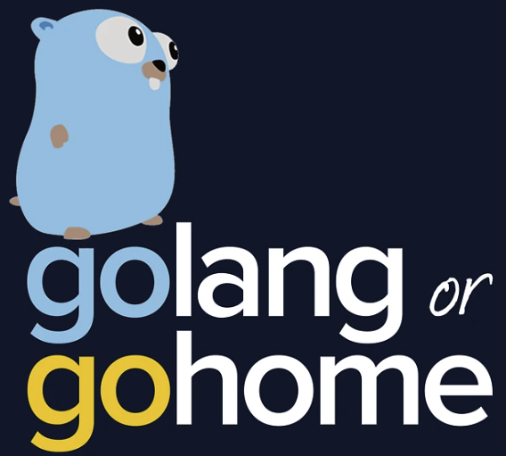

# Learning Golang

This is my repo for learning Golang (a.k.a. Go).

Most code is from the tutorials straight from [go.dev](https://go.dev/doc/tutorial/). There are also some from:

- [https://gobyexample.com/](https://gobyexample.com/)
- [Codecademy's Go course](https://www.codecademy.com/catalog/language/go)

### Here are links to some of the topics I've learned so far:

- [structs](Codecademy/loops-arrays-maps-structs)
- [maps](Codecademy/loops-arrays-maps-structs)
- [interfaces](Codecademy/structs-interfaces)
- [functions (and pointers)](Codecademy/functions)
- [type assertions on maps and interfaces](sandbox/type-assertions.go)
- [error handling](Codecademy/error-handling)
- [file handling](Codecademy/file-handling)

Coming soon:

- [goroutines]()
- [threading and concurrency]()
- [parallelism]()
- [generic functions]()
- [unit testing]()
- [accessing databases]()

### Other projects I've started writing in Go:

- [A simple REST API]()
- [A basic HTTP server]()

## Some of my favorite Go resources:

- [Fireship.io's Learn Go in 100 Lines by @alexguja](https://fireship.io/lessons/learn-go-in-100-lines/)
- [Structs in Golang by Sutirtha Chakraborty](https://golangdocs.com/structs-in-golang#google_vignette)
- [Go by Example by Mark McGranaghan and Eli Bendersky](https://gobyexample.com)
- [Tutorials from go.dev](https://go.dev/doc/tutorial/)